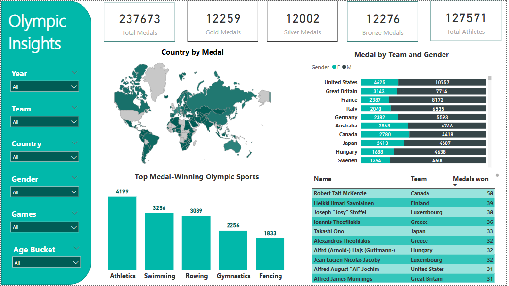

# Olympic Insights Dashboard with Power BI

This project visualizes and analyzes over a century of Olympic Games data using Power BI, helping uncover historical performance trends, gender-wise comparisons, and country-level dominance in sports.

---

## 📊 Overview

This dashboard is built using a merged and cleaned dataset from two different sources (Summer and Winter Olympic datasets). It includes:

- Medal counts by country
- Gender-wise medal distribution
- Top-performing athletes and teams
- Dominant sports by medal count
- Interactive filters by year, sport, gender, age bucket, team, and more

---

## 🛠 Tools Used

- Power BI
- DAX
- Python (Pandas)
- Data Modeling

---

## 📚 About the Dataset

- **124 years of Olympic History** (till 2020)
- **27 Summer Olympics** and **22 Winter Olympics**
- Sourced from two structurally different CSV files
- Unified using Pandas for compatibility

---

## 📌 Key Visuals

- Total Medals and Athlete KPIs
- Country-wise medal distribution (Map)
- Gender-wise medals per team
- Top medal-winning Olympic sports
- Top athletes with highest medal counts

---

## 📷 Dashboard Preview

---

